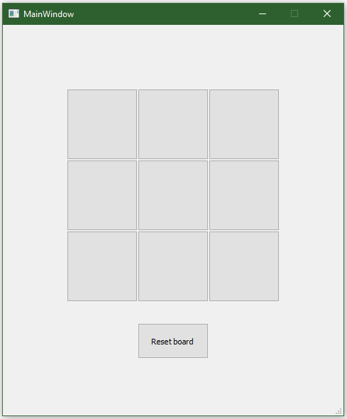

# QTtictactoe
QT based tictactoe

## How to run
Open the project in QT creator (4) and build it (QT 5.14.2 MinGW 32-bit)

## User interface
The user interface consists of 9 buttons, creating the game field. And a reset button.

## AI
The program employs a minimax algorithm. 

## Notes
- Reusing the AI for other games
- Adding alpha/ beta pruning

